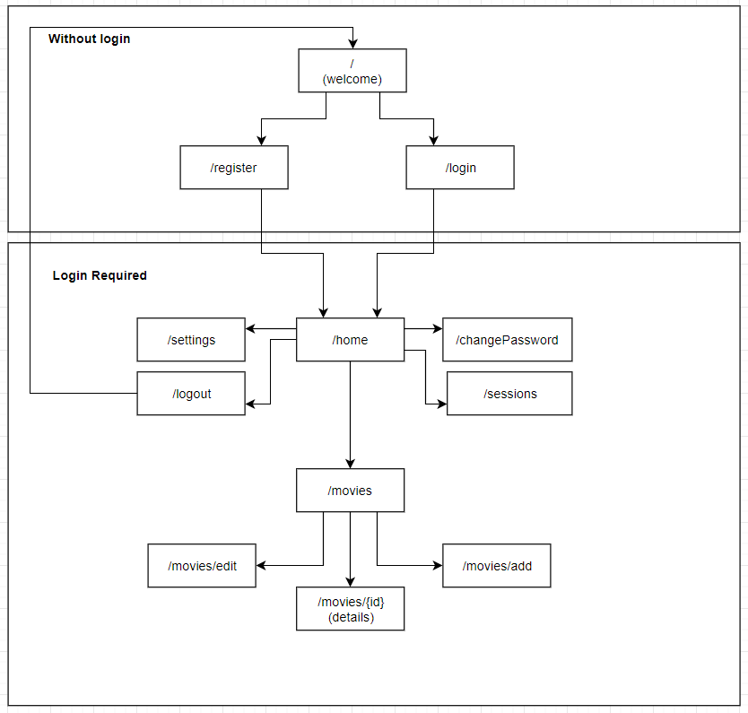

# Raportti

## Johdanto

MyMovieDatabase lyhyemmin MyMDB on elokuvakeräilijöille suunnattu sivusto, jolla on mahdollista pitää kirjaa elokuvakokoelmasta. 
Käyttäjätunnukset voi luoda kuka tahansa rekisteröitymislomakkeen avulla ja käyttäjätunnuksien luomisen jälkeen käyttäjä voi alkaa 
lisätä tietokantaan elokuviaan, ja tallentaa niistä tarkat tiedot ylös. Elokuvien lisäyksen yhteydessä käyttäjät voivat tietojen kirjoittamisen
sijasta hyödyntää imdb-tietokantaa, josta tiedot voidaan hakea automaattisesti imdbID:n avulla. Käyttäjien on myös mahdollista muokata elokuvien 
tyyppi valikoimaan profiilinsa asetuksien kautta. Jokaisella käyttäjällä on olemassa valmiina yleisimmät elokuvatyypit, mutta näiden lisäksi, 
jokainen voi lisätä henkilökohtaisia vaihtoehtoja. Elokuvalistauksen käyttäjät voivat nähdä ruutu tai lista näkymässä ja käyttäjät näkevät vain itse
lisäämänsä elokuvat.

## Yleistä

Sivusto on toteutettu käyttämällä Laravel alustaa, sekä PHP-, jQuery- ja JavaScript kieliä hyödyntämällä. Sivuston pääsisältö noudetaan hyödyntämällä API:ta ja
AJAX-kutsuja jQuerylla toteutettuna. Ainoastaan settings ja sessions sivujen tiedot luetaan ja tallennetaan PHP:llä Laravelin tietokanta yhteyksiä hyödyntämällä.
Elokuvien tiedot imdb-kannata haetaan hyödyntämällä [OMDb API:ta](http://www.omdbapi.com/).

## JavaScript, jQuery, PHP

**imdpUpdate** = Lataa elokuvan tiedot API:sta käyttäen imdbID:tä sekä asettelee tiedot oikeisiin kenttiin add/edit movie sivulla.   
**movies** = Sisältää suurimman osan sivuston toiminnallisuudesta. Elokuvalistan latautuessa hakee elokuva tyyppi tiedot ja määrän ja päivittää ne näkymään, sekä lataa elokuvien tiedot listaan ja ruudukkoon. Näiden lisäksi se myös vaihtaa sivua (pagination), hakee elokuvia hakusanalla ja näyttää niiden tiedot, sekä poistaa elokuvan.  
**saveMovie** = Hoitaa elokuvan tallentamisen/päivittämisen tietokantaan ja lataa elokuvan tiedot muokkaus näkymää.  
**viewSelector** = Pitää tallessa evästeissä kumpi näkymä ennen oli valittuna (list/grid) ja elokuvalistausta ladatessa valitsee oikean näkymän.  
**app.js** = Bootstrapin tarvitsema JavaScript tiedosto.   
**cookie.js** = Mahdollistaa evästeiden tallennuksen ja lukemisen selaimesta.  
**jquery-3.4.1.min.js** = jQuery kirjasto  
**pagination.js** = Hoitaa sivujen valitsimen luomisen, vaihtamisen ja hallinnan.  
**settings.js** = Hoitaa asetusvalikon elokuvan tyyppi valitsimen logiikan. Lisää ja poistaa kohteita sekä muuntaa valinnat CSV-muotoon, jossa ne tallennetaan tietokantaan.

```
----js
    ----movies
        imdbUpdate.js
        movies.js
        saveMovie.js
        viewSelector.js
    app.js
    cookie.js
    jquery-3.4.1.min.js
    pagination.js
    settings.js
```

## Istunnot

Käyttäjän kirjauduttua istunto tallennetaan tietokantaan ja voimassa olevia istuntoja on mahdollista hallita Session sivulta, joka löytyy käyttäjänimen alta valikosta.

## Asetukset

Käyttäjä voi muokata tilin tietoja ja asetuksia asetukset sivulla, joka löytyy käyttäjänimen alta valikosta.

## Tietokanta

[Linkki tietokannan dokumenttiin](Tietokanta.md)

## OMDb API

[OMDb API:ta](http://www.omdbapi.com/) hyödynnetään elokuvatietojen noutamisessa imdbID:n avulla ja koska tämä vaatii oman API-avaimen. Loin oman API kutsun, joka tekee
kutsun OMDb API rajapintaan palvelimen puolelta, jottei API-avainta tarvitsisi tallentaa käyttäjän puolelle.

## API

[Linkki API:n dokumenttiin](API.md)

## Sivustorakenne



## Kansiorakenne

Peruskansio rakenne. Laravellin kansio rakenteen monimutkaisuuden takia olen jättänyt pois suurenmäärän kansioita. Kuvassa vain mainitsemisen arvoiset kansiot, pääasiassa ne joihin olen tehnyt muutoksia..

```
laravel
|
|---app
    ----Exceptions
        Handler.php
    ----Http
        ----Controllers
            ---Auth
            ChangePasswordController.php
            RegisterController.php
        ApiController.php
        HomeController.php
        MovieController.php
|   Movie.php
|   Setting.php
|   User.php
|
|---database 
    ----migrations
        ...create_users_table.php
        ...create_movies_table.php
        ...create_sessions_table.php
        ...create_settings_table.php
|
|---public
    ----css
        auth.css
        bootstrap.min.css
        movies.css
        sessions.css
        settings.css
        styles.css
    ----js
        ----movies
            imdbUpdate.js
            movies.js
            saveMovie.js
            viewSelector.js
        app.js
        cookie.js
        jquery-3.4.1.min.js
        pagination.js
        settings.js
    ----img
        grid-three.up.svg
        home-bg.jpg
        imdb_logo.jpg
        list.svg
        no-poster-available.jpg
        pencil.svg
        rotten_tomatoes_logo.png
        trash.svg
|
|---resources
    ---views
        ----auth
            ----passwords
                change.blade.php
            login.blade.php
            register.blade.php
            session.blade.php
        ----layouts
            app.blade.php
        ----movies
            detail.blade.php
            movie.blade.php
            view.blade.php
        home.blade.php
        settings.blade.php
        welcome.blade.php
|
|---routes
    api.php
    web.php
|
|.env
|


```