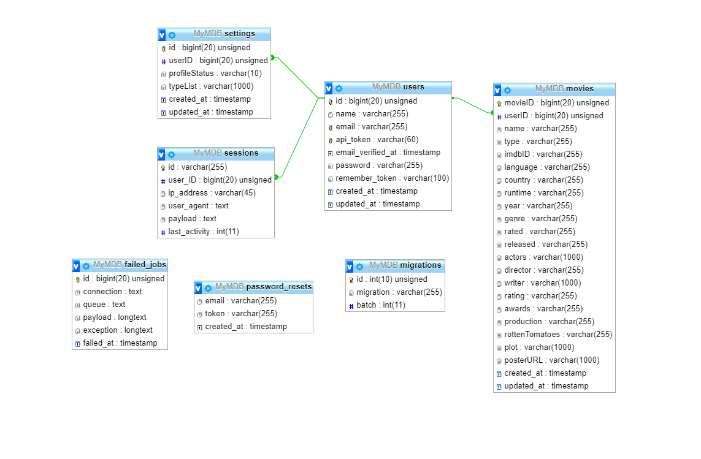

# Tietokanta



Tietokantaan tallennetaan käyttäjien tiedot heidän tallentamien elokuvien tiedot sekä kirjautumisistunnot. Tietokanta on toteutettu MySQL ja sen luomiseen on käytetty laravelin migration scriptejä.

## Users -taulu

```php
    Schema::create('users', function (Blueprint $table) {
        $table->bigIncrements('id');
        $table->string('name');
        $table->string('email')->unique();
        $table->string('api_token', 60)->unique()->nullable();
        $table->timestamp('email_verified_at')->nullable();
        $table->string('password');
        $table->rememberToken();
        $table->timestamps();
    });
```

## Movies -taulu

```php
    Schema::create('movies', function (Blueprint $table) {
        $table->bigIncrements('movieID');
        $table->unsignedBigInteger('userID');
        $table->string('name');
        $table->string('type')->nullable()->default("NoValue");
        $table->string('imdbID')->nullable();
        $table->string('language')->nullable();
        $table->string('country')->nullable();
        $table->string('runtime')->nullable();
        $table->string('year')->nullable();
        $table->string('genre')->nullable();
        $table->string('rated')->nullable();
        $table->string('released')->nullable();
        $table->string('actors', '1000')->nullable();
        $table->string('director')->nullable();
        $table->string('writer', '1000')->nullable();
        $table->string('rating')->nullable();
        $table->string('awards')->nullable();
        $table->string('production')->nullable();
        $table->string('rottenTomatoes')->nullable();
        $table->string('plot', '1000')->nullable();
        $table->string('posterURL', '1000')->nullable();
        $table->timestamps();
        
        // Add Foreign Keys
        $table->foreign('userID')->references('id')->on('users')->onDelete('cascade')->onUpdate('cascade');
    });
```

## Sessions -taulu

```php
    Schema::create('sessions', function (Blueprint $table) {
        $table->string('id')->unique();
        $table->unsignedBigInteger('user_ID')->nullable();
        $table->string('ip_address', 45)->nullable();
        $table->text('user_agent')->nullable();
        $table->text('payload');
        $table->integer('last_activity');

        // Add Foreign Keys
        $table->foreign('user_ID')->references('id')->on('users')->onDelete('cascade')->onUpdate('cascade');
    });
```